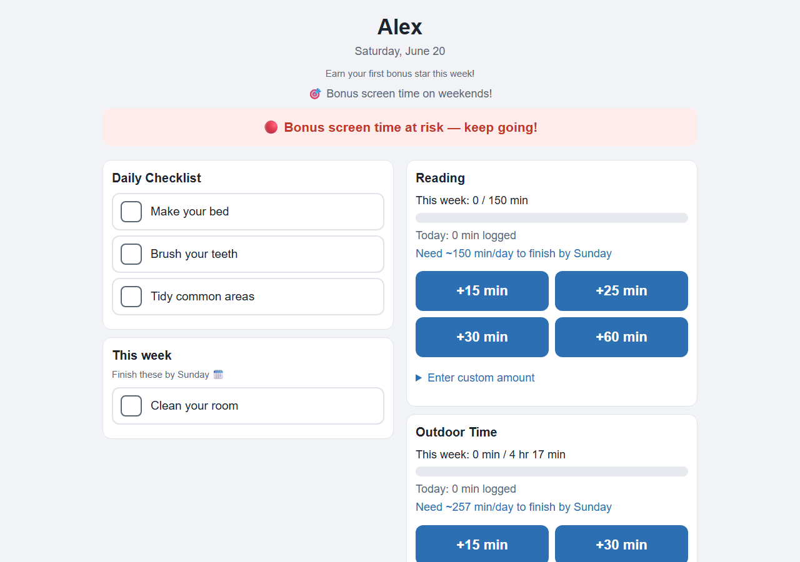
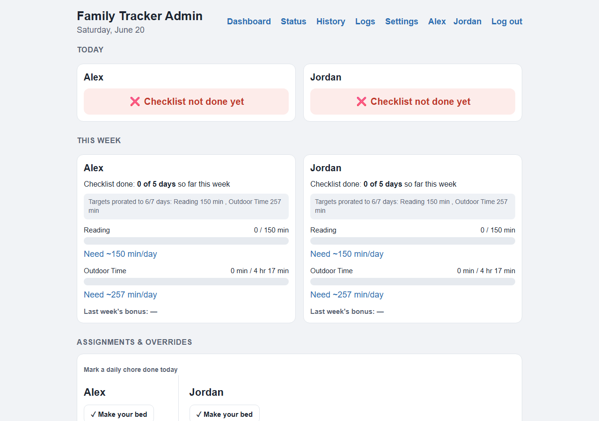
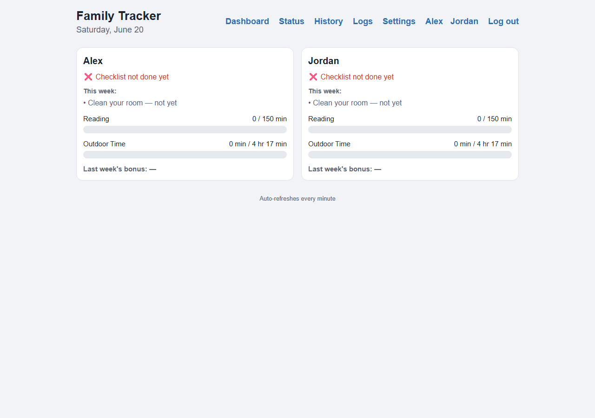
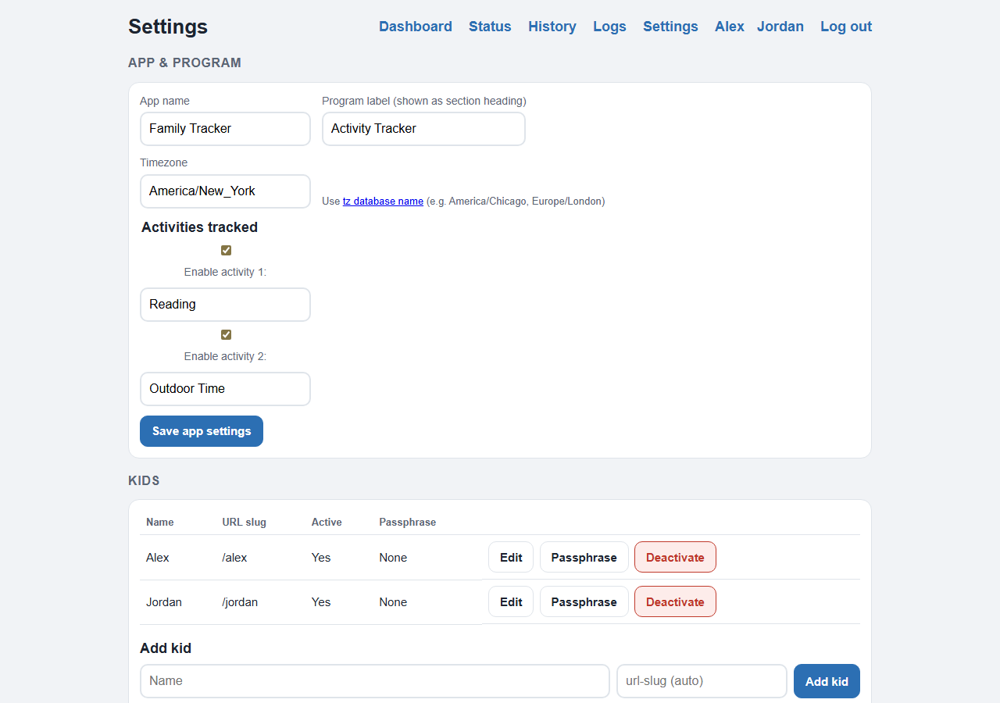

# ChoreBoard

**A simple chore and habit tracker your kids run themselves.**

Every morning your kids open their own page on a tablet or phone, check off their chores, and log things like reading or outdoor time. If they hit their goals for the week, they earn a reward you choose — extra screen time, allowance, whatever works in your house. You get a notification when they're done and a dashboard showing how everyone's doing.

No accounts to create, no monthly fee, no data leaving your home. It runs on your own computer or home server.

> Built with plain Flask + SQLite. One small Docker container, no database server to manage.

---

## Is this for you?

ChoreBoard is a good fit if:

- You want kids to track their own chores without nagging.
- You'd like to tie a reward to finishing the week.
- You're comfortable running a **Docker container** on a home server, NAS, or an always-on PC. *(If you've never used Docker, the [Deploy](#deploy-with-docker) section walks through it — but this isn't a hosted app you just sign up for. You run it yourself.)*

It works great for the summer, the school year, or all year round — you set the start and end dates (or leave it running indefinitely).

---

## What it looks like

**Each kid's page** — daily checklist, weekly chores, activity logging, and a scoreboard of stars and streaks:



**Your dashboard** — today's status and the week's progress for every kid at a glance:



**Status page** — a read-only view you can leave open on a kitchen tablet, no password needed:



**Settings** — kids, activities, goals, the reward, vacations, and notifications:



---

## Who uses what

- **Kids** get their own page at a simple link (e.g. `yourserver/alex`). The link *is* their login — no password to remember. They check off chores and log their minutes themselves.
- **You** get a password-protected dashboard to see everyone's progress, mark chores done, assign extra ones, set goals, and handle vacations.
- **The whole family** can leave the status page up on a shared tablet — it auto-refreshes and needs no password.

---

## How the week works

- **Chores** come in a few flavors: every day, every other day, once a week, on a specific weekday with a countdown, or one-off "do this today" assignments.
- **Activities** are optional things kids log toward a weekly target — reading and outdoor time out of the box. Add your own (practice piano, glasses of water, pages read…), each measured in minutes or as a count, rename them, or turn them all off for a pure chores setup.
- **The bonus.** Each week a kid who hits their goals earns a star and the reward you set. If you turn activities off, the bonus is simply about finishing the daily checklist — you choose how many days a week count.
- **Points (optional).** Give each chore a point value and kids rack up points as they go — handy for a pocket-money system. Set a dollars-per-point rate and the page shows what they've earned this week.
- **Reminders.** ChoreBoard can send you a phone notification mid-morning if a kid hasn't finished, plus a Sunday-evening wrap-up of the week.
- **Vacations.** Mark a trip or camp and ChoreBoard pauses chores (or auto-credits outdoor time) so a week off doesn't break anyone's streak.

---

## Deploy with Docker

```bash
git clone https://github.com/batterbob/choreboard.git
cd choreboard
cp .env.example .env   # then edit .env with your own values
docker compose up -d --build
```

Check that it started:

```bash
docker compose logs -f
# look for: Scheduler started (minute interval)
```

Open `http://your-server-address:7823` in a browser. The first time, ChoreBoard walks you through a short setup: app name, timezone, your kids, the activities you want to track, and the reward. Everything is changeable later in Settings.

Your data lives in `./data/` on the host (a SQLite file), so it survives restarts and updates. To update later: pull the latest code and run `docker compose up -d --build` again — the database migrates itself without losing anything.

---

## Configuration (`.env`)

A few settings live in a `.env` file in the project folder. It's gitignored — never commit it. Start from the template:

```dotenv
ADMIN_PASSWORD=change-me-before-first-run
PORT=7823
TZ=America/New_York
CHORE_DEBUG=0

# Optional: ping a monitor each minute so you know the app is alive
# HEALTHCHECK_URL=https://your-monitor-url/ping
```

- **`ADMIN_PASSWORD`** — set a real password before the first run. Change it later in Settings.
- **`TZ`** — your local timezone, e.g. `America/Chicago`, `Europe/London`. All the day-by-day logic runs in this zone.
- **`PORT`** — the port ChoreBoard listens on (default 7823).
- **`CHORE_DEBUG`** — leave `0` normally.

---

## Notifications

ChoreBoard can send a push notification when a kid finishes and a weekly summary on Sunday. Supported services include **Pushover, Telegram, Discord, Slack, ntfy, and Gotify** (anything [Apprise](https://github.com/caronc/apprise) supports). Pick one in **Settings → Notifications**, paste in your credentials, and hit *Send test notification* to confirm it works. There's step-by-step help next to each service.

---

## Monitoring (optional)

ChoreBoard has a health endpoint at `/healthz` that returns `ok` when the app and database are healthy. For peace of mind that the background scheduler keeps running, set `HEALTHCHECK_URL` in your `.env` — the app pings it every minute, so a monitor like Uptime Kuma or Healthchecks.io can alert you if it ever goes quiet. Leave it blank to skip.

---

## Good to know

- **One process on purpose.** ChoreBoard runs as a single process so the background reminders fire exactly once. Don't put it behind a multi-worker server.
- **Local network only.** There's no HTTPS built in — run it on your home network.
- **Your data is yours.** Export everything to a JSON file from Settings any time, and restore from that file just as easily.

---

## License

MIT — see [LICENSE](LICENSE). Use it, change it, share it.
